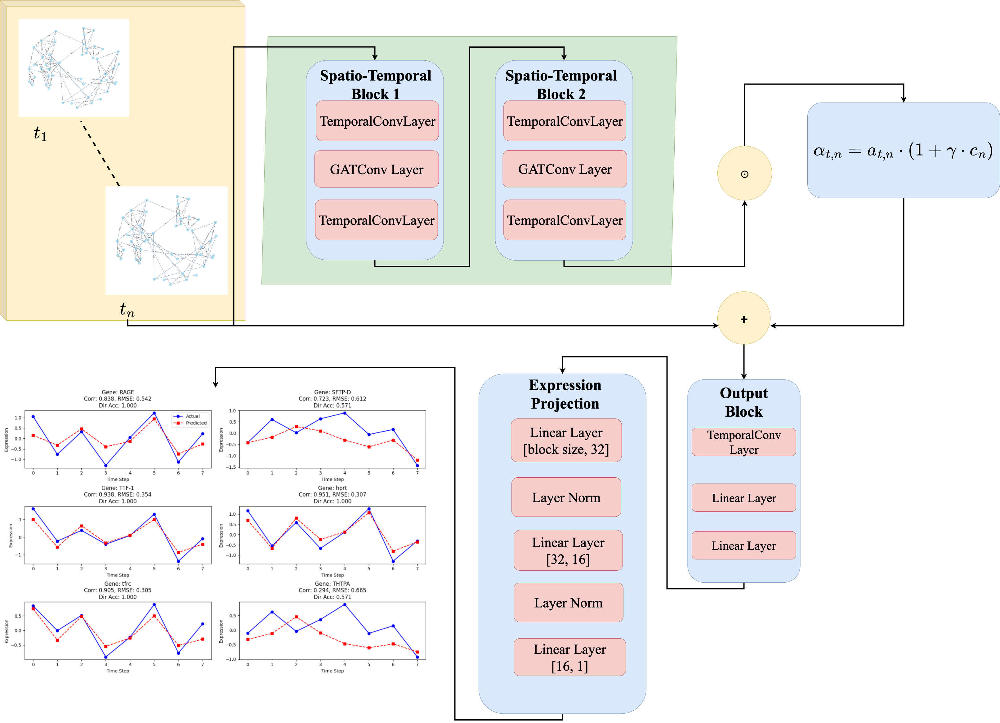

# STEP
Spatio-Temporal Expression Prediction


## Overview
The goal of this project is to use neural network-based spatio-temporal graph models to predict temporal gene expression. We created two algorithms to predict mRNA and miRNA expression across time, STEPmr and STEPmi, by integrating Hi-C datasets capturing genome-wide gene interactions. With correlations of 77% for mRNA and 93% for miRNA, our models perform effectively and account for an important portion of the variance. Highly predictable genes are generally structural or regulatory genes involved in essential biological processes, whereas genes with context-dependent functions are less predictable. These results highlight the influence of interacting gene dynamics on temporal expression patterns.

## Problem Formulation
We aim to predict temporal gene expression for mRNAs and miRNAs while understanding the underlying biological context. Our goals are:
1. Improve gene expression prediction by incorporating gene interactions and genome spatial organization from Hi-C data.
2. Analyze predicted patterns biologically, using pathway and functional enrichment analyses.

Genes are nodes in our dynamic graph model of gene expression, while edges stand for spatial and regulatory relationships. Two neural networks with spatiotemporal graphs are used:
- **STEPmr:** Optimized for sparser mRNA datasets, with temporal Node2vec embeddings capturing dynamic neighborhoods.  
- **STEPmi:** Handles complex miRNA datasets using spatio-temporal blocks, LSTM, and multi-head attention.  

Predictions are biologically interpretable, revealing processes like neural remodeling, metabolism changes, and stress response. Key innovations include spatio-temporal GNNs, temporal embeddings, biologically-informed edge weights, and a custom multi-component loss function.

## Dataset Specifications
This project uses two separate datasets for the interacting target genes of **miRNA** and **mRNA**, each with different numbers of time points and total number of target genes.  
The datasets are enriched with biologically relevant structural features obtained from Hi-C data, including:
- **Insulation scores**  
- **Topologically Associated Domain (TAD) boundaries**  
- **A/B chromatin compartments**

Each dataset is organized such that:

- **Rows** represent pairs of interacting genes across multiple time points.  
- **Columns** include raw expression values and enhanced structural/functional features.  
- These datasets serve as the foundation for creating dynamic spatio-temporal graphs used in the models.

### Dataset Files

- `dataset/mrna/interaction_mrna.csv` → Contains processed mRNA interaction data with enriched features  
- `dataset/mirna//interaction_mirna.csv` → Contains processed miRNA interaction data with enriched features

## Architectures
We propose two separate neural architectures tailored to the distinct characteristics of **mRNA** and **miRNA** datasets.  
Both architectures use **Spatio-Temporal Graph Convolutional Networks (ST-GCNs)** as a backbone, with dataset-specific enhancements.

### STEPmr (for mRNA)

- Backbone: **ST-GCN**  
- Two **Spatio-Temporal (ST) blocks**  
- **Connectivity attention** module to capture dependencies among connected genes  
- Designed for sparser temporal datasets with fewer target genes
**Architecture Diagram**  


---  

### STEPmi (for miRNA)

- Backbone: **ST-GCN**  
- Three **Spatio-Temporal (ST) blocks**  
- **4-layer Bidirectional LSTM** to model long-range temporal dependencies  
- **4-layer Multi-Head Attention** to capture complex regulatory relationships  
- Designed for larger and more complex miRNA datasets with more target genes and time points  

**Architecture Diagram**  


## Environment Setup

### Prerequisites
- Anaconda or Miniconda installed
- Python 3.8+

### Installation Instructions
**Step 1: Create Conda Environment**
```bash
conda create -n STEPenv python=3.8 pytorch torchvision torchaudio -c pytorch -c conda-forge
```

**Step 2: Activate Environment**
```bash
conda activate STEPenv
```

**Step 3: Install PyTorch Geometric Dependencies**
```bash
pip install torch-geometric torch-cluster torch-scatter torch-sparse torch-spline-conv
```

**Step 4: Install Additional Required Packages**
```bash
pip install gensim gseapy node2vec pyvis biothings-client mygene adjustText openpyxl
pip install pandas matplotlib seaborn scikit-learn scipy jupyter requests pyyaml tqdm
```

## Running the Scripts
The project provides separate scripts for training and testing the models for mRNA and miRNA datasets. These scripts handle model training, make predictions on the test set, and generate additional plots for analysis.

### mRNA Dataset (dataset/mrna/interaction_mrna.csv)

To train and test the mRNA model (`STEPmr`), run:

```bash
python -m mrna.STEPmr_train_test
```

- This script trains the STEPmr architecture on the mRNA dataset.
- After training, it generates predictions on the test set.
- Plots summarizing the results (e.g., predicted vs actual expression) are saved automatically.

### miRNA Dataset (dataset/mirna/interaction_mirna.csv)

To train and test the miRNA model (`STEPmi`), run:

```bash
python -m mirna.STEPmi_train_test
```
- This script trains the STEPmi on the miRNA dataset.
- Predictions and visualizations for test sets are produced automatically.
- Plots and outputs are stored in the designated results folder.

### Additional Scripts
A number of additional scripts are included in the project to support data processing and model training in addition to the core training/testing scripts:

#### Raw Data Processing

- **`raw_data_conversion/` folder**  
  Scripts for preprocessing and integrating biological data:
  - Maps Hi-C interactions to gene expression data across chromosome bins. 
  - Converts normalized Hi-C data into features usable for graph construction.   
  - Adds additional biologically relevant features to original expression dataset.

#### Graph Creation and Node Embeddings

- **`create_graph_and_embedding_STEPmr.py/create_graph_and_embedding_STEPmi.py`**  
  This scripts generates separate graphs for each time point.  
  - Node features include temporal Node2vec embeddings.  
  - Edges are constructed based on biologically informed criteria, integrating Hi-C interactions, TAD boundaries, chromatin compartments, insulation scores, and gene expression values.

#### Temporal Loss Functions

- **`step_losses.py`**  
  Contains temporal-aware loss functions used by `STEPmr_train_test` and `STEPmi_train_test`.  
  - Includes directional loss, temporal trend loss, and prediction consistency loss.  
  - These losses help the models better capture dynamic gene expression patterns over time handle early convergence.


